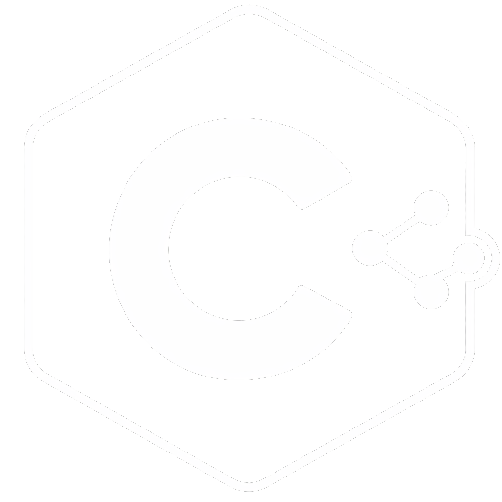

# C Learn

C Learn is a machine learning framework written in pure C. It implements core ML algorithms and basic data preprocessing from scratch, using only the C standard library and no external dependencies.

This is a work-in-progress project built for learning, experimentation, and low-level insight into machine learning.
# Author
Boris Mirkovic  
https://www.bm11.dev/
